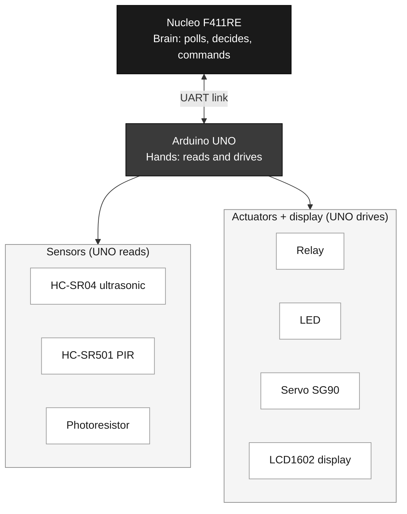

```mermaid
flowchart TB
    Nucleo["Nucleo F411RE<br/>Brain: polls, decides, commands"]
    UNO["Arduino UNO<br/>Hands: reads and drives"]

    Nucleo <-->|UART link| UNO

    subgraph Sensors["Sensors (UNO reads)"]
        US["HC-SR04 ultrasonic"]
        PIR["HC-SR501 PIR"]
        Photo["Photoresistor"]
    end

    subgraph Actuators["Actuators + display (UNO drives)"]
        Relay["Relay"]
        LED["LED"]
        Servo["Servo SG90"]
        LCD["LCD1602 display"]
    end

    UNO --> Sensors
    UNO --> Actuators

    classDef brain fill:#1a1a1a,stroke:#000,color:#ffffff,stroke-width:1px
    classDef hands fill:#3a3a3a,stroke:#000,color:#ffffff,stroke-width:1px
    classDef group fill:#f5f5f5,stroke:#888,color:#1a1a1a,stroke-width:1px
    classDef leaf fill:#ffffff,stroke:#999,color:#1a1a1a,stroke-width:1px

    class Nucleo brain
    class UNO hands
    class Sensors,Actuators group
    class US,PIR,Photo,Relay,LED,Servo,LCD leaf
```
